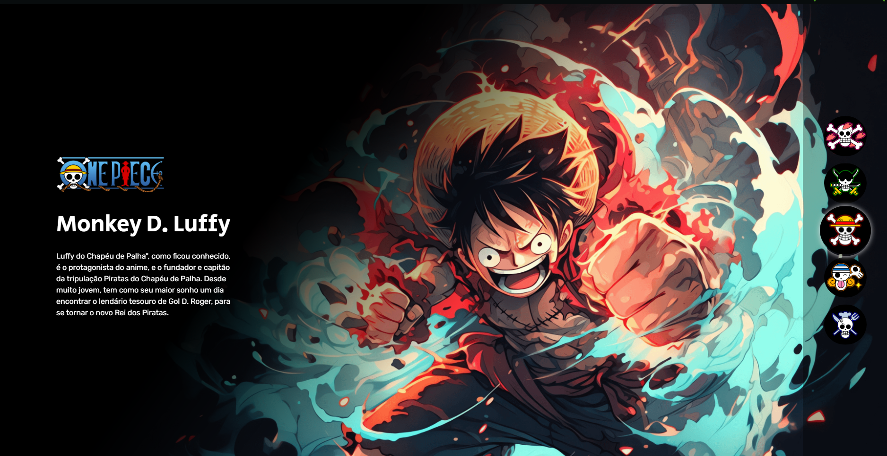

# Dev Em Dobro - Projeto One Piece



## 💡 Descrição

Projeto desenvolvido com base no mini curso do canal Dev em Dobro.

📺 Youtube [Dev em Dobro](https://www.youtube.com/c/DevemDobro)

## 🚀 Tecnologias utilizadas

- HTML
- CSS
- JavaScript

## 📸 Demonstração

[Demonstração](https://frraphael.github.io/onepiece/)

## 🔧 Como rodar localmente

```bash
git clone https://github.com/frraphael/onepiece.git
cd onepiece
```
